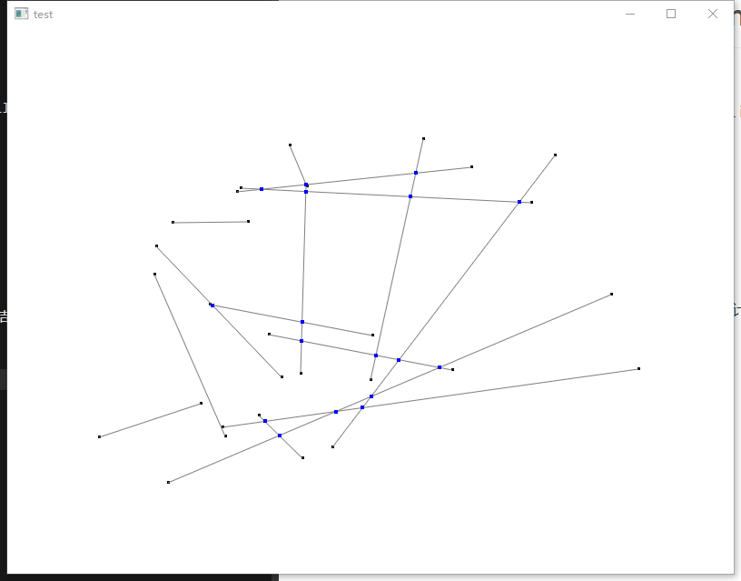
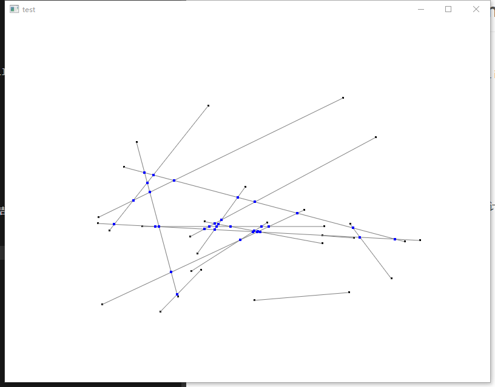

# mult-line-segments-Intersection
====================

扫描线算法求若干条线段的交点，并用OpenGL绘制结果

A sweep line algorithm for segments intersection, with OpenGL illustrating the result.

在VS 2022环境下开发

Compiled with Visual Studio 2022.

需要OpenGL环境

Need OpenGL environment.

在OpenGL环境下运行时，调整窗口大小以产生新的线段集同时计算新的结果

Resize the window to get new segments set and result.
## 效果图   renderings

